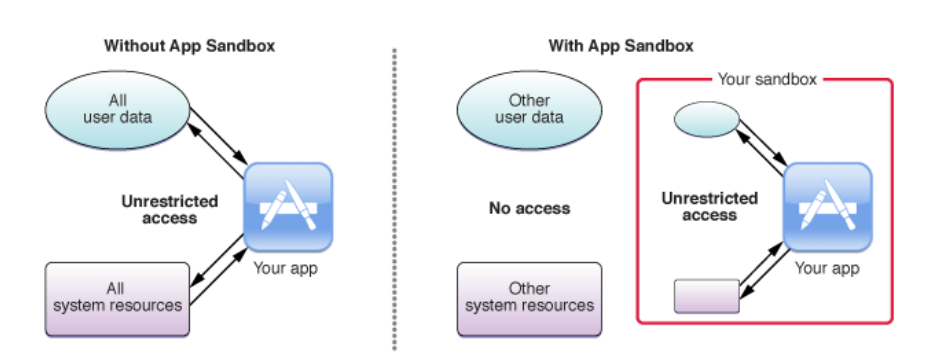

# 운영체제의 역할과 iOS에서의 운영체제 구조에 대해 설명해주세요.

1. 프로세스와 스레드의 차이점, iOS에서의 프로세스와 스레드 관리 방법에 대해 설명해주세요.
2. 메모리 관리 기법 중 iOS에서 사용되는 방식과 그 특징에 대해 설명해주세요.
3. iOS의 샌드박스(Sandbox) 개념과 역할, 앱 간 데이터 공유 방법에 대해 설명해주세요.

<br>

# 운영체제
### 운영체제란?
  
*운영체제*

사용자(응용 프로그램)와 하드웨어의 사이에 존재하며, 프로세스가 하드웨어 자원을 효율적으로 사용할 수 있도록 관리 및 제어하며, 사용자와 컴퓨터간 상호작용을 연결하는 역할을 한다.

**운영체제의 역할**
1. 자원관리
컴퓨터 시스템의 메모리, 프로세스, 장치, 파일 등을 관리한다.

2. 메모리관리
- 각각의 프로세스가 효율적으로 구동될 수 있도록 정책에 따라 `메인 메모리`를 적절히 할당 및 회수한다.
- `보조 저장장치`에 새로운 파일을 저장(기록)할 때 공간을 할당하며, 파일 생성 및 삭제에 관여한다.

3. 프로세스관리
실행중인 프로세스 또는 실행될 프로세스가 필요한 자원을 할당하며 프로세스간 통신, 프로세스 중지 및 재시작 등을 수행한다.

4. 주변장치관리
마우스, 키보드, 모니터, 스피커등 입출력 장치들을 `장치 드라이버`를 통해 상호작용한다. 

5. 명령 해석기(Shell)
사용자와 운영체제간 상호작용을 위한 `시스템 소프트웨어` 이다.
사용자가 필요로 하는 작업을 명령어를 통해 해석기에 전달하면 운영체제는 해당 명령을 수행한다.


<br>

# 프로세스와 스레드의 차이점
### 프로세스란?
프로그래머가 작성한 프로그램이 디스크에 저장되어있다가, 필요한 시점에 메모리에 적재되어 CPU 가 실행할 수 있는 상태가 된 것을 **프로세스**라고 한다.

초기에 사용되는 컴퓨터는 프로그램을 한번에 하나씩만 실행했고, 프로그램은 컴퓨터 자원을 독점했지만, 기술에 발전함에 따라 여러 가지 프로그램을 동시에 실행시키기 위해
이를 제어하는 방법이 필요했고, 이 과정에서 생겨난 개념이 **프로세스** 이다.

운영체제는 메인 메모리의 일정부분을 **프로세스**가 사용할 수 있도록 할당해주는데, 이 때 할당된 프로세스의 메모리 구조는 다음과 같다.

  
*프로세스의 메모리 구조*

**프로세스의 메모리 구조**
- 코드(Code)
`코드`영역은 실행될 `프로그램의 코드`가 저장되는 영역이다.
일반적으로 읽기 전용(Read-Only)이며, 실행 중에 수정되지 않는다.

- 데이터(Data)
`데이터`영역은 `전역 변수`와 `정적 변수` 가 저장되는 영역이다.
실행되기 전에 초기화되며, 프로그램 종료 시 소멸된다.
읽기, 쓰기가 가능하다.

- 스택(Stack)
`스택`영역은 일시적인 데이터가 저장되는 영역이다. 함수 내부에서 사용된 `지역 변수`, 함수의 `반환 값`, `반환 주소`(함수가 종료된 후 복귀할 주소), `매개변수` 등에서 사용하며 사용된 후 제거된다.
> 함수가 너무 많이 호출되면 할당된 스택영역을 초과하게되는 순간이 오는데 이를 **스택 오버플로우** 라고 한다.

*위 3가지 영역의 메모리 할당 크기는 프로그램을 컴파일할 때 정해진다.*

- 힙(Heap)
`힙`영역은 `실행 중에 메모리를 원하는 만큼 할당`받을 수 있는 영역이다.
> C언어의 메모리 동적할당 함수인 `malloc` 은 이 힙 영역에 얼마만큼 메모리를 할당할지 요청한다.

<br>

### 스레드란?
프로세스 내부에서 실행되는 **작은 작업 단위** 이며, 하나의 프로세스에는 최소 1개의 스레드가 존재하며, 여러개가 존재할 수 도 있다.

운영체제로부터 개별적으로 자원을 할당받는 `프로세스`와는 다르게, 프로세스 내부에 존재하는 `스레드`는 프로세스의 자원을 공유하여 사용한다.

### 프로세스와 스레드의 차이점
1. 데이터 전달 방식
**프로세스**는 운영체제로 자원을 할당받기 때문에 서로간의 데이터를 전달하기 위해서 운영체제에서 제공하는 `프로세스간 통신(IPC)`을 사용하는데, 데이터 공유를 위한 `공유 공간` 또는 직접적인 통신을 위한 `파이프`를 연결해야하는 반면
**스레드**는 프로세스에 할당된 메모리를 공유하기 때문에 데이터 전달이 용이하다.
2. 데이터 처리 방식
  
*단일 스레드와 멀티 스레드*  
**프로세스**(단일 스레드)는 연산을 위한 프로세서를 1개만 할당받을 수 있으며, 다양한 작업(ex: 파일을 다운로드 받으면서 키보드 입력을 받고, 문서작업 진행 등)이 필요할경우, 순차적으로 처리 또는 우선순위에 따라 필요한 만큼 프로세서를 사용한 뒤 멈추고 다음 작업이 사용하는 등 즉각적인 응답에 있어 불리하다.
**스레드**(다중 스레드)는 각 프로세서가 하나의 스레드를 담당하여, 동시에 많은 연산을 처리할 수 있다.
반응성이 중요한 작업 (UI 업데이트, 타이머 동작) **만 처리하는 스레드**를 만들고 프로세서를 할당할경우 오래걸리는 작업이 있더라도 문제가 발생하지 않는다.

<br>

### iOS에서의 프로세스와 스레드 관리 방법
**프로세스 관리 방법**  
iOS의 프로세스(앱)는 기본적으로 **시스템(iOS) 에 의해 관리**되며, 사용자가 앱을 실행 및 종료하거나 시스템 메모리 부족, 앱 업데이트 등의 이벤트가 일어나면 메모리에 할당 또는 해제된다.

**큐**  
iOS의 스레드 관리 방법을 알아보기에 앞서, iOS에서 사용되는 **큐**에 대해 알아보자.

iOS 앱(프로세스)에서는 기본적으로 앱이 실행될 때 두 가지 `큐(Queue)` 와 `메인 스레드(Main Thread)`를 제공해준다.

**메인 큐**  
첫 번째는 `메인 큐(Main Queue)`라고 부르며,
일반적으로 개발자가 작성한 코드는 `메인 큐`에서 동작한다.
이 `메인 큐`에 전달된 작업들은 `메인 스레드` 가 처리한다.

`메인 스레드` 는 `UI 스레드` 라고도 불리는데, 사용자와 상호작용하는 
UI 처리는 모두 `메인 스레드`에서 진행되어야하기 때문이다.
> UI 처리를 하나의 스레드가 **모두 전담하는 이유**는 동시에 여러개의 스레드가 하나의 UI 를 변경할경우, **UI 충돌가능성** 이 있기 때문이다.
> 또 과도한 작업을 정해진 시간에 처리하지 못할경우, 시스템이 앱이 멈췄음을 감지하고 오류를 발생시킴으로서 무거운 작업을 미연에 방지할 수 있다는 장점이 있다.

`메인 스레드(= Main Thread, Interface Thread)`를 제외한 나머지 스레드는 모두 `백그라운드 스레드(Background Thread)` 라고 불리며 이 스레드들은 다양한 작업을 수행한다.
ex) 이미지 다운로드, 음원 재생, 파일 업로드 등

**글로벌 큐**  
두 번째 큐는 `글로벌 큐(Global Queue)` 라고 부르며,
이 역시 `메인 큐` 와 동일하게 시스템이 자동으로 생성해준다.

`메인 큐`와 다르게 Concurrent 특성을 가지고 있으며, 이 큐에 할당된 작업은
하나의 스레드가 담당하는게 아닌 여러개의 스레드가 작업을 처리하는 특성을 가지고 있다.

**커스텀 큐**  
마지막 큐는 `커스텀 큐(Custom Queue)` 라고 부르며,
개발자가 상황에 맞게 동작방식과 우선순위를 설정한 뒤 작업을 보낼 수 있는 큐이다.


**스레드 관리 방법**  
iOS 에서 스레드들은 개발자가 직접적으로 **생성 및 제거를 할 수 없으며**, 단지 `큐`에게 작업의 우선순위와, 어떤 방식으로 동작할지만 정의한다.

그렇다면 어떻게 이러한 `스레드`들을 관리할 수 있을까?
iOS 에서는 **GCD(Grand Central Dispatch)** 를 통해 스레드를 관리한다.

**Grand Central Dispatch**  
**GCD** 는 **Dispatch Queue API**를 제공하는데, 개발자가 하고싶은작업을 **Dispatch Queue** 에 전달하면 스레드를 `적절하게 생성`해서 분배해주며 작업이 종료된 후 스레드를 `제거 하는 역할`을 한다.

`더 자세한 내용과 실제 사용방법은 2레벨의 1번 질문에서 자세히 다루도록 하겠다.`

<br>

# iOS 에서 사용되는 메모리 관리 기법  
iOS 에서는 **ARC(Auto Reference Counting)** 라는 방식으로 메모리사용을 추적하고 관리한다.

**ARC**에 알기전에 먼저 `weak` 와 `strong` 개념에 대해 알아보자

**weak & strong**  
Swift 에서는 `weak` 와 `strong` 키워드를 지원하는데, 객체가 생성될 때 어떤 방식으로 참조할 건지 결정하는 방식이다.

아무런 명시를 해주지 않았다면 `strong` 을 가지며, `강한참조`라고 부른다.
변수 명 앞에 weak 가 선언되어있다면 `약한참조` 이다.

변수를 어떻게 참조하느냐에 따라서 `참조 카운팅(Refrence Count)`에 변화가 생기는데 이제 ARC에 대해 알아보자.

**ARC**  
ARC(Auto Reference Counting) 은 `참조 카운트`라는 방식을 통해 객체가 참조하고있는 숫자를 세어서 객체의 **할당해제여부를 판단**한다.

ARC 는 객체가 생성되면 객체에 대한 `참조 카운트`를 하나 **증가**시키며, 객체가 제거되면 `참조 카운트`를 하나 **감소**시킨다.

`참조 카운트` 가 **0**이 되면 객체를 제거하며, 메모리에서 할당 해제 된다.

`strong` 으로 선언된 객체는 생성될 때 참조 카운트를 하나 증가시킨다.
그에 반해 `weak` 로 선언된 객체는 생성될 때 참조 카운트가 증가되지않는다.

```swift
var strongRef = Person(name: "구태호")
```

`strongRef`는 `strong`으로 **Person** 객체를 참조하고 있으며 참조 카운트는 `1` 이다.

```swift
strongRef = nil
```
`strongRef`에 **nil**을 할당함으로써 참조를 제거하며, 참조카운트가 `0` 으로 변경되어 메모리에서 해제된다.

**순환참조문제**  
순환참조란 두 객체가 **서로를 강하게 참조**하여, 두 객체의 참조를 제거했음에도 해제되지않는 문제를 말한다.

아래 예시를 보자  
```swift
class Man {
    var house: House?

    deinit {
        print("Man 해제")
    }
}

class House {
    var man: Man?

    deinit {
        print("House 해제")
    }
}

var man: Man? = Man()
var house: House? = House()

man?.house = house
house?.man = man

man = nil
house = nil
```

Man 클래스는 House 클래스를 가지고 있고, House 클래스는 Man 클래스를 가지고 있다.

man 인스턴스는 house 인스턴스를 참조하며, house 인스턴스는 man 인스턴스를 참조한다.

man 과 house 인스턴스의 참조를 nil 로 변경한다.

두 인스턴스의 참조는 nil 이 되었기 때문에 `deinit` 메소드가 호출되어야하지만 호출되지않는다.

그 이유는 다음과 같다
1. `man` 변수에 Man 인스턴스가 **할당될 때** 참조 카운트 1 증가(총합 1)
2. `house.man` 변수에 `man` 변수의 참조 전달 참조 카운트 1 증가(총합 2)
3. `man` 변수에 **nil 할당** 참조 카운트 참조 카운트 1 감소(총합 1)

`man` 의 참조 카운트는 아직 1이 남은 상태이지만, Man의 `deinit` 이 호출되지않으며, 더 이상 참조할 수 없기 때문에 메모리 누수가 일어난다.

<br>

# iOS 의 샌드박스(SandBox)란?
### 샌드박스란?
  
*앱 샌드박스*  

> 샌드박스(sandbox)란 외부로부터 들어온 프로그램이 보호된 영역에서 동작해 시스템이 부정하게 조작되는 것을 막는 보안 형태이다.

**샌드박스** 는 악의적인 목적을 가진 개발자가 컴퓨터의 시스템 자원이나 사용자의 개인정보에 함부로 접근하지 못하도록 접근을 제한하는 개념을 말한다.

iOS 에서는 각각의 App 마다 모두 `샌드박스`가 적용되어있으며, 앱은 자기자신만의 **샌드박스 디렉토리를 할당**받아, 필요한 경우 이곳에 저장한다.

이 샌드박스 디렉토리는 **타 앱에서 접근**할 수 없다.

**샌드박스 디렉토리의 구성**
- Bundle Container: 앱 번들이 포함된 디렉토리
- Data Container: (사용자나 앱에의해) 생성된 데이터가 포함된 디렉토리
- iCloud Container: 런타임 시점에 접근을 요청할 수 있는 디렉토리


### 앱 간 데이터 공유 방법
iOS의 샌드박스 정책으로 인해, `파일 시스템`에 접근하여 앱간 데이터를 공유하는 방식이 불가능하다.

그럼에도 다양한 방식으로 앱 간 데이터 공유가 가능하다.

1. 클립보드(UIPasteBoard)  
시스템 클립보드에 저장하는 PasteBoard API를 사용하면 앱 간 데이터 공유가 가능하다.
2. 앱 그룹(App Groups)  
동일한 팀이 개발한 앱 간 공유 컨테이너에 액세스하여 데이터를 쉽게 공유하는 방식이다.
3. 앱 스킴(URL Scheme)  
앱 고유의 URL 형식을 정의하고, 외부에서 해당 URL을 호출하여 앱을 엶과 동시에 URL에 포함된 데이터를 사용할 수 있는 방식이다.
4. 공유 패널(UIActivityViewController)  
  
*공유 패널*  
클립보드, 타 앱, 파일시스템에 정보를 저장할 수 있는 기능을 가진 API 이다.


<br>

# 참고
- 그림으로 배우는 구조와 원리 운영체제 개정 3판: 한빛 아카데미 > 컴퓨터 하드웨어의 구성 
- https://learn.microsoft.com/ko-kr/windows-hardware/drivers/gettingstarted/what-is-a-driver- (드라이버란)
- https://rjswn0315.tistory.com/54 (명령해석기)
- https://velog.io/@cchloe2311/%EC%9A%B4%EC%98%81%EC%B2%B4%EC%A0%9C-%ED%94%84%EB%A1%9C%EC%84%B8%EC%8A%A4-%EB%A9%94%EB%AA%A8%EB%A6%AC-%EA%B5%AC%EC%A1%B0 (프로세스의 메모리 구조)
- https://zangzangs.tistory.com/107 (프로세스 메모리 구조)
- https://velog.io/@saint6839/C%EC%96%B8%EC%96%B4-%EB%8F%99%EC%A0%81-%EB%A9%94%EB%AA%A8%EB%A6%AC-%ED%95%A0%EB%8B%B9-%E
- https://jerryjerryjerry.tistory.com/m/184 (스레드란?)
- https://velog.io/@coastby/%EC%9A%B4%EC%98%81%EC%B2%B4%EC%A0%9C-IPC-Inter-Process-Communication-%ED%94%84%EB%A1%9C%EC%84%B8%EC%8A%A4-%EA%B0%84-%ED%86%B5%EC%8B%A0 (프로세스간 통신)
- https://www.youtube.com/watch?v=x-Lp-h_pf9Q (프로세스와 스레드의 차이 [영상])
- https://hyunndyblog.tistory.com/178 (iOS 에서의 Thread, GCD)
- https://luke-kong.oopy.io/a94ce6b2-8379-409f-92d2-19ee2f218947 (iOS 에서의 멀티 스레딩)
- https://asuhdevstory.tistory.com/entry/MainUI-Thread-%EB%9E%80-Worker-Thread-%EB%9E%80 (Worker Thread 란)
- https://velog.io/@syong_e/TIL-UI%EC%9E%91%EC%97%85%EC%9D%80-%EC%99%9C-%EB%A9%94%EC%9D%B8%EC%8A%A4%EB%A0%88%EB%93%9C%EC%9D%B8%EA%B0%80 (UI 작업은 왜 메인스레드인가)
- https://babbab2.tistory.com/65 (GCD)
- https://sujinnaljin.medium.com/ios-%EC%B0%A8%EA%B7%BC%EC%B0%A8%EA%B7%BC-%EC%8B%9C%EC%9E%91%ED%95%98%EB%8A%94-gcd-5-c8e6eee3327b (ios 차근차근 시작하는 gcd)
- https://babbab2.tistory.com/27 (strong , weak, unowned, 순환 참조)
- https://medium.com/@yong076/ios-%EA%B0%9C%EB%B0%9C%EC%97%90%EC%84%9C-%EB%A9%94%EB%AA%A8%EB%A6%AC-%EA%B4%80%EB%A6%AC-%EB%B0%8F-%EC%B5%9C%EC%A0%81%ED%99%94-%EB%B0%A9%EB%B2%95-7bed8cac54b4 (ios 메모리 관리 및 최적화 방법)
- https://ko.wikipedia.org/wiki/%EC%83%8C%EB%93%9C%EB%B0%95%EC%8A%A4_(%EC%BB%B4%ED%93%A8%ED%84%B0_%EB%B3%B4%EC%95%88) (샌드박스 (컴퓨터 보안))
- https://blog.naver.com/doctor-kick/222447929246 (앱 샌드박스)
- https://developer.apple.com/documentation/xcode/configuring-app-groups (앱 그룹 구성)
- https://developer.apple.com/documentation/xcode/defining-a-custom-url-scheme-for-your-app (URL Scheme)