# 컴퓨터 구조와 관련하여 CPU, RAM, 저장장치의 역할과 상호 작용에 대해 설명해주세요.
1. 캐시 메모리의 개념과 종류, 역할에 대해 설명해주세요.
2. CPU 아키텍처의 종류(예: ARM, x86)와 특징에 대해 설명해주세요.
3. iOS 기기에서 사용되는 AP(Application Processor)의 특징과 역할에 대해 설명해주세요.

# 캐시 메모리
### 캐시 메모리란?
> Cache 의 사전적인 뜻은 **은닉처, 저장용 땅굴**을 의미한다.

캐시(Cache) 메모리는 컴퓨터 과학에서 데이터나 값을 미리 복사해 놓는 임시 장소를 가리킨다.

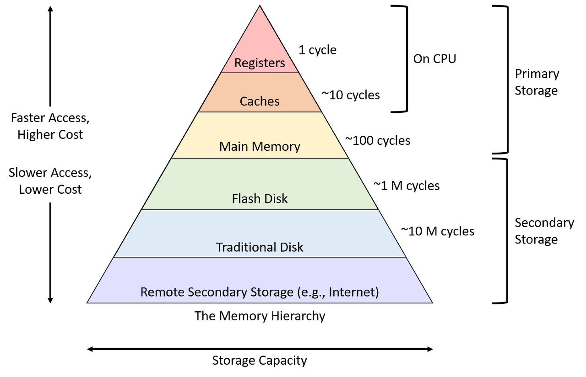
*메모리 계층 구조*

프로세서가 사용할 데이터를 보관하는 가장 빠른 메모리인 `레지스터` 다음으로 빠른 메모리다.

 

### 캐시 메모리의 종류와 역할
**cpu 캐시**
프로세서 내부에 위치하며, `주기억장치`에 용량대비 가격이 비싸지만 데이터 전송속도가 느린 `주기억장치`에 비하면 월등히 빠르기 때문에 둘 사이의 간극을 좁히기 위해 사용된다.

시중에 판매되는 cpu의 캐시는 속도와 용량에 따른 차등을 둔 `L1/L2/L3 캐시`를 탑재하여 판매한다.

L은 Level을 의미하며 `L1` > `L2` > `L3` 순으로 성능이 좋지만 용량이 줄어든다.

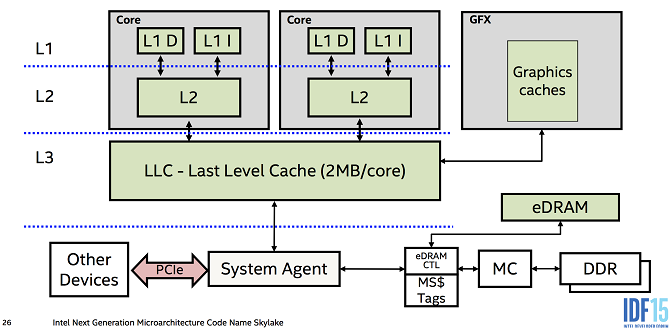
*1 - 캐시 레벨*
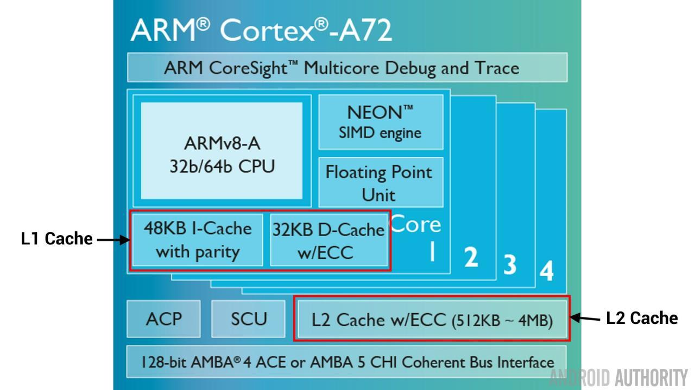
*Cortex-A72의 캐시*

일반적으로 `L1 캐시`는 각 코어마다 탑재되며 CPU 가 가장 먼저 접근하는 캐시이다. 여기서 원하는 데이터를 찾지 못하면 `L2 캐시` 로 넘어간다.

`L2 캐시` 는 각 코어마다 또는 공유 메모리 형태로 탑재되며 부족한 `L1 캐시` 용량을 대신해주는 역할을 한다.

`L3 캐시` 는 코어가 데이터를 함께쓰는 공유 메모리 형태로 탑재되며, 용량이 가장 크지만, 속도가 주 기억장치에 비해 조금 더 빠른수준이다.

**+소프트웨어 캐시**
- 웹(HTTP) 캐시: 웹 페이지에 접속한 뒤 이미지나 페이지(html, css) 등을 저장하고 있다가, 사용자가 **다시 요청**할 때, 저장된 파일을 렌더링함.
> 브라우저는 서버의 응답이 오기전 빠르게 렌더링할 수 있으며, 서버는 부하를 줄일 수 있는 장점이있다.
- 이미지 캐시: iOS의 웹 이미지 프레임워크인 `Kingfisher`는 한번 다운로드된 이미지를 메모리나 디스크에 저장하고있다가, 동일한 URL 로 요청이 왔을 때 저장된 이미지를 표시해준다.

 

### 캐시의 성능과 지역성
캐시는 `주기억장치`의 데이터를 `블록`단위로 들고와서 프로세서에 `워드` 단위로 전달하여 속도를 높인다.

**시간적 지역성**
한번 참조된 데이터는 곧 다시 참조될 가능성이 높다는 것을 의미한다.
> 메인 메모리에서 캐시로 데이터를 `블록`단위로 들고오는 이유이다.

**공간적 지역성**
참조한 주소와 인접한 주소의 내용을 참조할 가능성이 높다는 것을 의미한다.
> 프로그램은 명령어를 순차적으로 처리하는 특성이 있기 때문이다.

 

# CPU 아키텍처(= Microarchitecture)
### CPU 아키텍처란?
CPU 내에 탑재될 코어와 캐시의 배치부터, 트랜지스터 사이의 간격(ex. `5나노`, `3나노 공정`)과 같은 하드웨어 설계의 의미와 
사용자가 내린 명령을 CPU가 이해하고 처리할 수 있는 최소단위인 `기계어 명령(Instruction)` 을 모아둔 `명령어 집합 구조(Instruction Set Architecture)` 를 포함한 개념을 의미한다.

### CPU 아키텍처의 종류와 특징
**CISC 기반**
명령어의 길이가 가변적이며, 복잡하지만 하나의 명령으로 복잡한 연산이 가능하다.
주로 개인용 컴퓨터 및 서버, 메인프레임 등에서 사용된다.
- x86(= 80x36)

*인텔 80386 프로세서*
1985년 인텔에서 출시한 최초의 32비트 프로세서인 `80386` 가 채택한 CPU 아키텍처 구조.
이 설계 방식에 맞게 만들어진 프로세서들을 `x86 프로세서`라고 칭한다.

- x86_64(= amd64, IA-64)
AMD에 의해 고안된 64비트 CPU 아키텍처 구조.
`32비트` 응용 프로그램에서도 호환되도록 설계되었다. (IA-64 는 해당X)
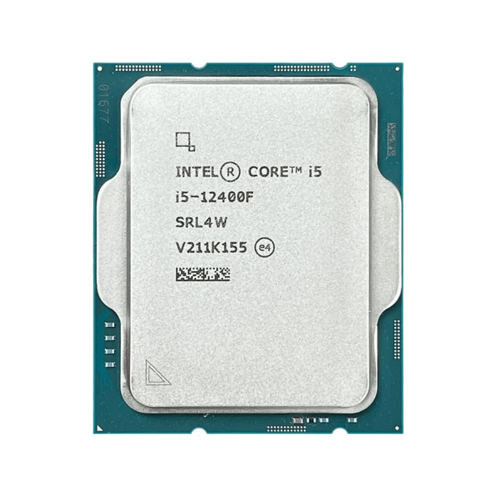
*x86_64을 대표하는 인텔사의 코어 i 프로세서*

**RISC 기반**
명령어의 길이가 고정되어있으며, 단순하기에 빠른 명령어 처리가 가능하다.
전력 소모가 적어 임베디드 시스템이나 모바일, iot 기기에 주로 사용된다.
- arm
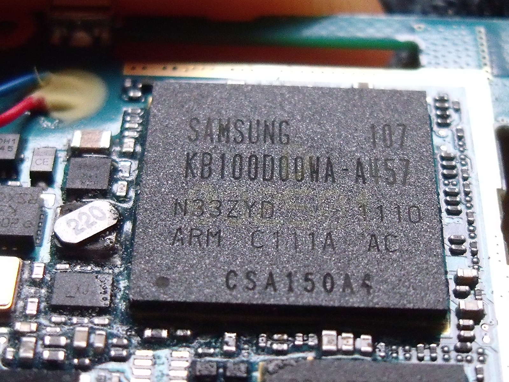
*갤럭시 s 에 탑재된 엑시노스 3110*

- arm64
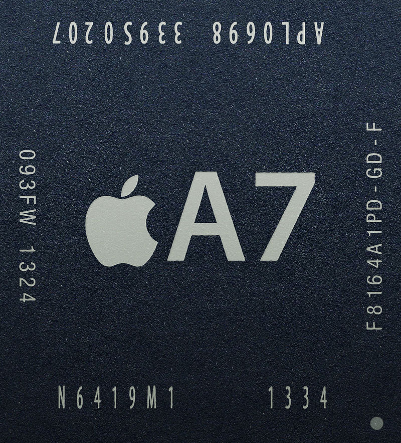
*아이폰 5s 에 탑재된 A7*
arm32 에 대한 호환성을 지원하며, 더 큰 레지스터 크기와 확장된 `명령어 세트`를 지원해 더 높은 성능을 제공한다.

**32bit 와 64bit 의 차이**
왜 32비트 프로세서보다 64비트 프로세서가 좋다고 말하는걸까?

`n비트 프로세서` 에서 말하는 `n` 은 CPU 가 처리하는 데이터의 최소 단위인 레지스터의 크기가 몇 bit 인가를 의미하는 것이다.

1. 처리할 수 있는 데이터의 크기
- 32비트 프로세서: 한번에 처리할 수 있는 데이터가 `2의 32승`(= 4,294,967,296) 이지만,
- 64비트 프로세서: `2의 64승`(= 18,446,744,073,709,551,616) 이다.
> 64비트 프로세서는 한번에 처리가능한 데이터가 크기때문에 연산 속도가 빠르다.

2. 주소할당 제한 문제
- 32비트 프로세서: 약 `4GB` 정도의 메모리 인식이가능하다.
- 64비트 프로세서: 약 `16EB(Exa Byte)` 정도의 메모리 인식이 가능하다.
> 64비트 프로세서는 현시점 무한대에 가까운 메모리 인식이 가능하다.

 

### 

# iOS 기기에서 사용되는 AP
### AP(Application Processor) 란?
모바일 기기에 탑재되어 **주 연산을 담당**하는 칩을 AP 라고 부른다.
2008년 출시된 아이폰을 기점으로 모바일 시장이 급격하게 커지면서 그만큼 AP에 대한 중요성도 커졌다.
 

### AP의 특징과 역할
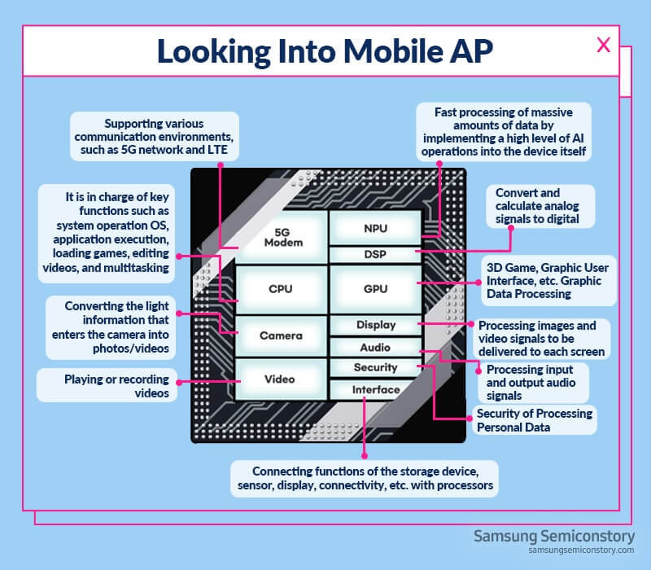
*모바일 AP의 구조*

데스크탑에 들어가는 CPU와 모바일 기기에 탑재되는 AP를 서로 구분하는 이유는
CPU는 연산만 담당하지만, AP는 연산뿐만아니라 그래픽을 처리하고, 5G 나 4G 등 인터넷을 연결(**MODEM**) 하고, 카메라 이미지를 처리(**ISP**)하고, 음성 및 영상 신호를 처리(DSP) 하는 등 수많은 기능이 한데 모아졌기 때문이다.

AP는 시스템이 칩안에 모두 내장되었다고해서 **SOC(System On Chip)** 이라고도 부른다.

### AP의 종류
다양한 제조사에서 다양한 스마트폰을 출시하는만큼 AP의 종류도 다양하다.
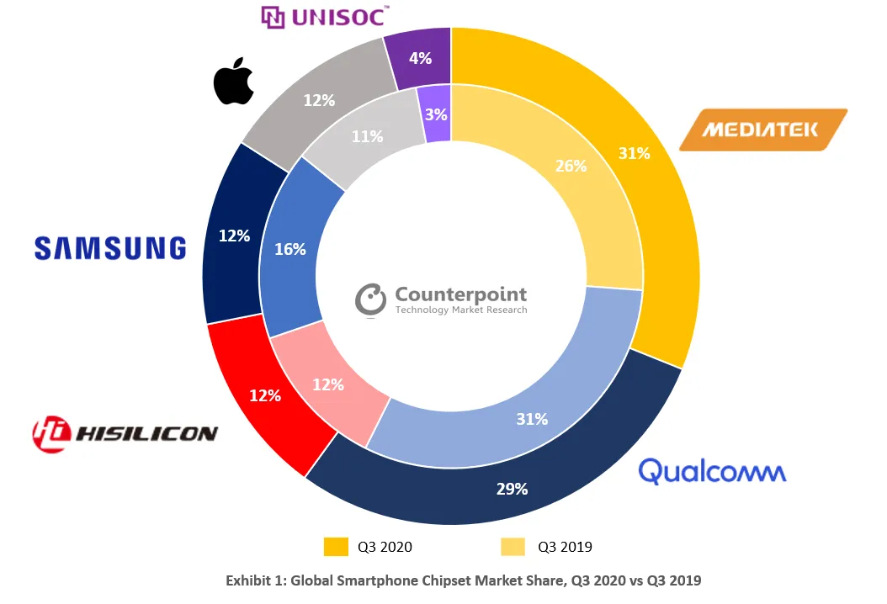
*다양한 제조사의 AP 점유율 (2020년 3분기 기준)*

1. 삼성의 엑시노스(Exynos)
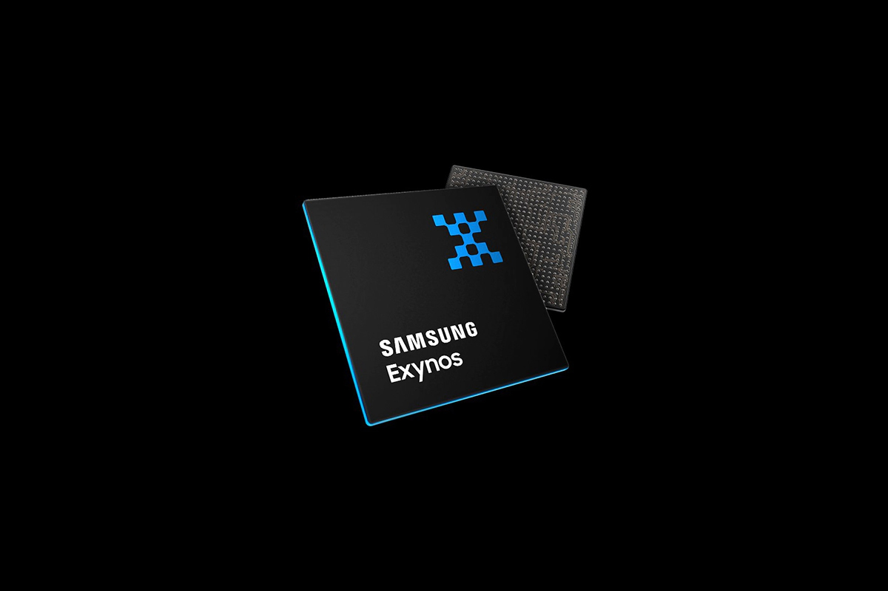
*엑시노스*
삼성이 설계 및 생산을하며, 주로 갤럭시 시리즈에 탑재된다.

2. 애플의 A시리즈

*A17 pro*
애플사의 iPhone 에 주로 탑재되며, 애플사에서 만든 기기에만 탑재된다는 특징이 있다.

3. 퀄컴의 스냅드래곤(Snapdragon)
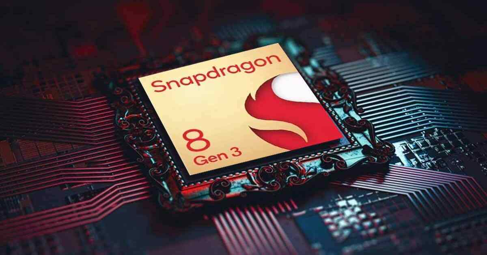
*Snapdragon Gen 3*
안드로이드 운영체제가 탑재된 스마트폰에 대거 탑재되어왔으며, 최근 미디어텍 사에서 만든 디멘시티의 급격한 성장으로 점유율이 줄어들었다.

4. 엔비디아의 테그라(Tegra)
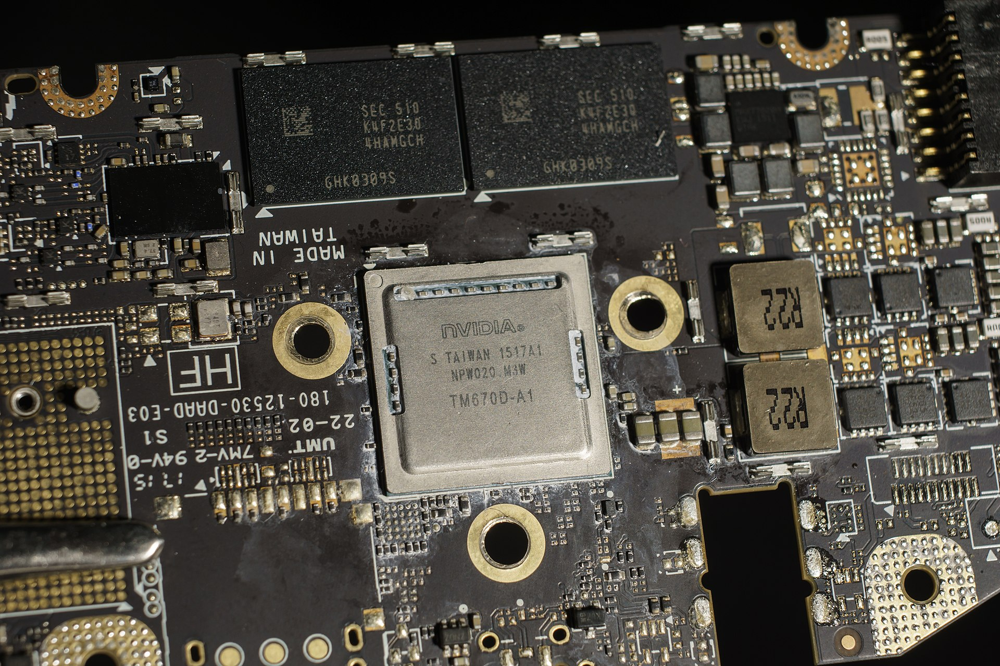
*테그라 x1*
엔비디아에서 만든 AP인 Tegra 시리즈는 그래픽 연산에 특화되어있으며, 
해당 AP를 탑재한 대표적 기기 중 하나는 닌텐도사의 Switch 가 있다.

# 참고
- https://ko.wikipedia.org/wiki/%EC%BA%90%EC%8B%9C (캐시란)
- https://12bme.tistory.com/402 (CPU 와 캐시)
- https://woozzang.tistory.com/155 (시스템 캐시란?)
- https://ssoonidev.tistory.com/35 (캐시 메모리와 매핑방법)
- https://ko.wikipedia.org/wiki/%EB%A9%94%EB%AA%A8%EB%A6%AC_%EB%B8%94%EB%A1%9D (메모리 블록)
- https://ko.wikipedia.org/wiki/%EC%9B%8C%EB%93%9C_(%EC%BB%B4%ED%93%A8%ED%8C%85) (프로세서의 워드)
- 그림으로 배우는 구조와 원리 운영체제 개정 3판: 한빛 아카데미 > 컴퓨터 하드웨어의 구성 
- https://ko.wikipedia.org/wiki/%EB%AA%85%EB%A0%B9%EC%96%B4_%EC%A7%91%ED%95%A9 (명령어 집합: ISA)
- https://crone.tistory.com/459 (아키텍처란 무엇일까)
- https://velog.io/@jinh2352/%EB%AA%85%EB%A0%B9%EC%96%B4-%EC%A7%91%ED%95%A9-%EA%B5%AC%EC%A1%B0-ISA (명령어 집합 구조 ISA)
- https://bulletproofyuri.tistory.com/5 (CPU 아키텍처)
- https://ko.wikipedia.org/wiki/X86 (x86)
- https://www.anandtech.com/show/7304/apple-announces-a7-worlds-first-64bit-smartphone-soc (A7)
- https://bluese05.tistory.com/17 (Window ghksruddptj 32bit 와 64bit)
- https://blog.naver.com/rlarudfbf12/220346647271 (32비트 64비트? 윈도우의 4GB 메모리 인식 한계란 과연 무엇인가?)
- https://news.samsung.com/kr/482 (AP 란 무엇인가?)
- https://news.skhynix.co.kr/post/mobile-not-cpu (CPU가 아니라 모바일 AP라 불리는 이유)
- https://trts1004.tistory.com/12108872 (ISP의 개요)
- https://greedyourlife.com/entry/%EC%8A%A4%EB%A7%88%ED%8A%B8%ED%8F%B0-%EC%95%A0%ED%94%8C%EB%A6%AC%EC%BC%80%EC%9D%B4%EC%85%98-%ED%94%84%EB%A1%9C%EC%84%B8%EC%84%9CAP%EB%9E%80 (애플리케이션 프로세서란)
- https://semiconductor.samsung.com/kr/support/tools-resources/dictionary/semiconductor-glossary-dsp/ (DSP 란)